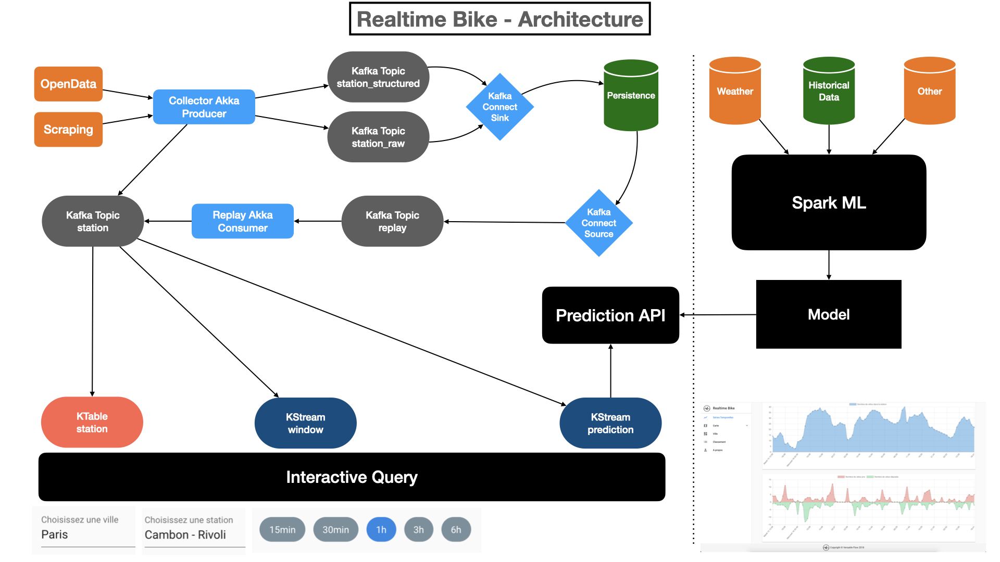
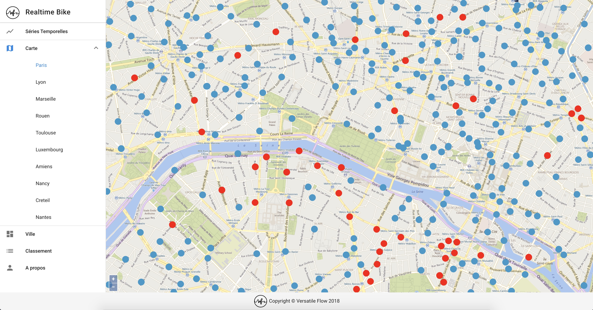
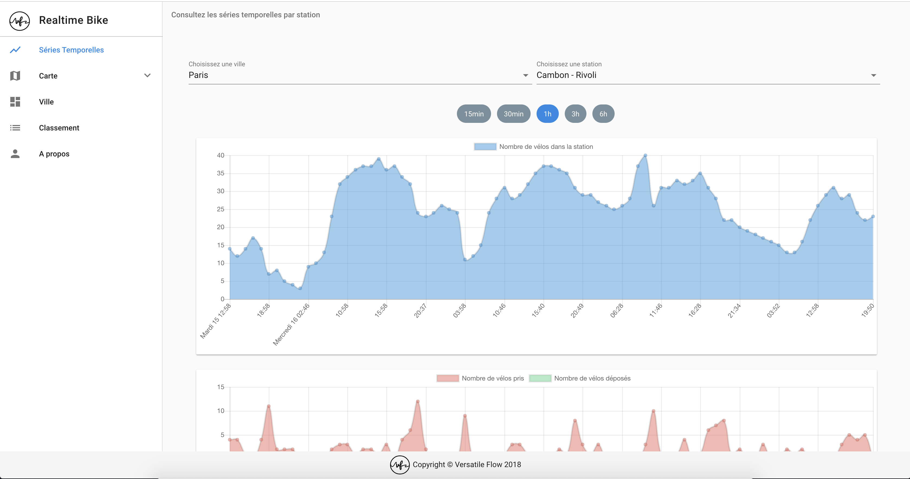
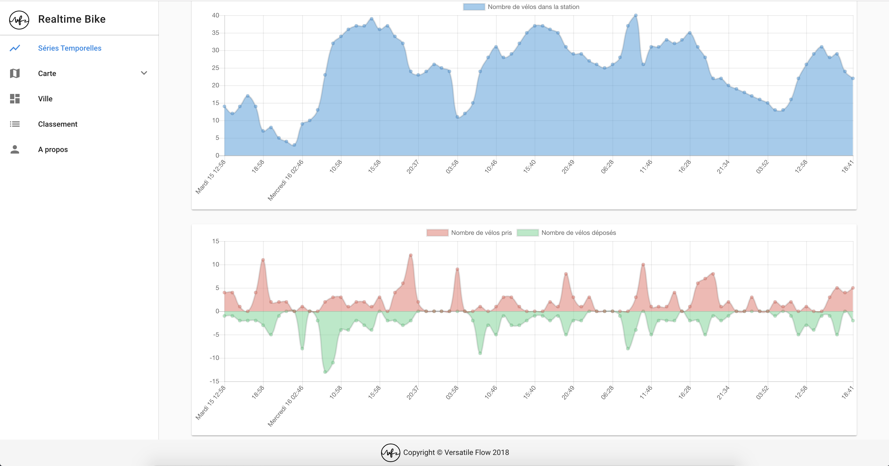
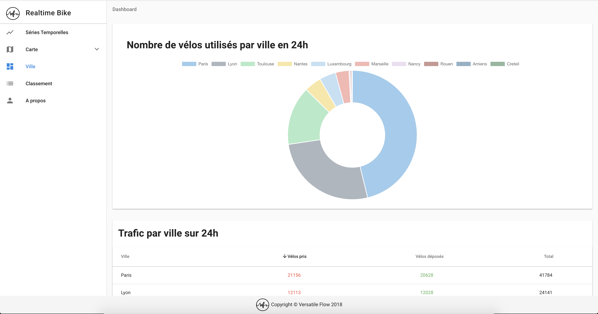
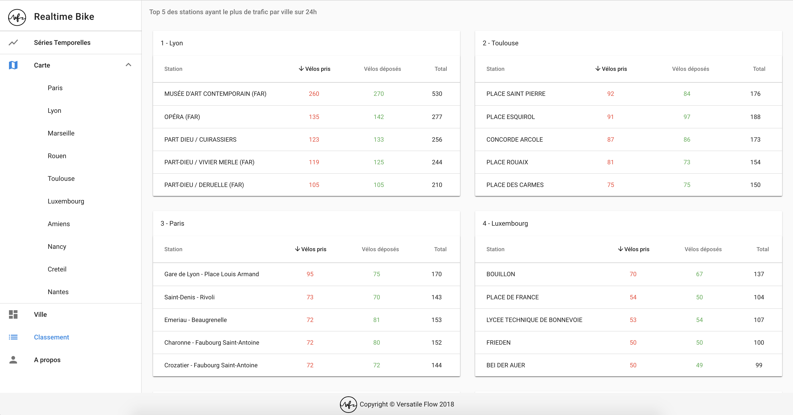

# Realtime Bike

## Description

* Modular Application
    * collector: collect data
    * processor: aggregate data
    * analyzer: prediction and classification
    * frontend: display data, map, charts
    * scripts: infrastructure deployments and operations

## Technologies

* Event Sourcing: Kafka, Kafka Stream
* Querying: Websockets, Rest, Kafka Interactive Queries
* Frontend: Vue.js/Nuxt.js
* Analysis: Spark Streaming
* Storage: File System (HDFS like)

## Architecture

## App

